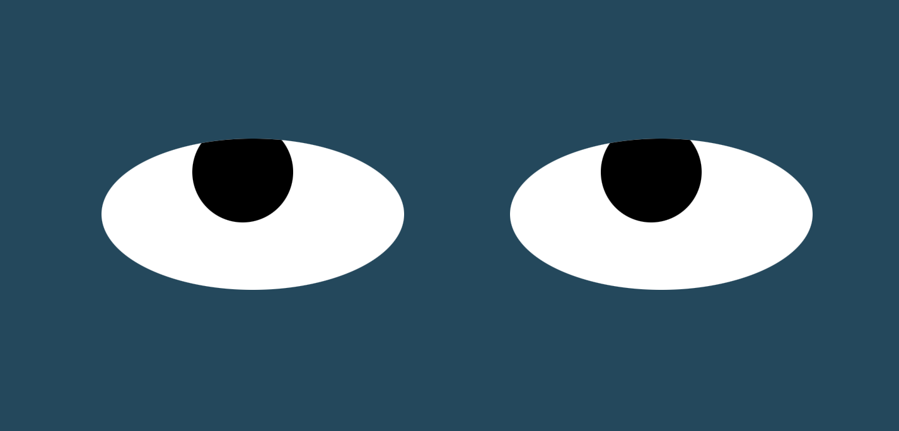

# Eye-movement

## Description
This exercise uses CSS and Javascript to track cursor movement. The eyes on the page follow your cursor as you move it around.

## Installation
How to view and/or use this project  
- Download files.
- Keep all files in their respective folders.
- Open the HTML file in your browser.

## Usage
Open the HTML file in your browser.  
Move your cursor in the direction you want the eyes to move.

## Roadmap    
- Change eye color
- Change eye size  

## License information  
Code from MIT | Xpro and Jennifer Eldridge
